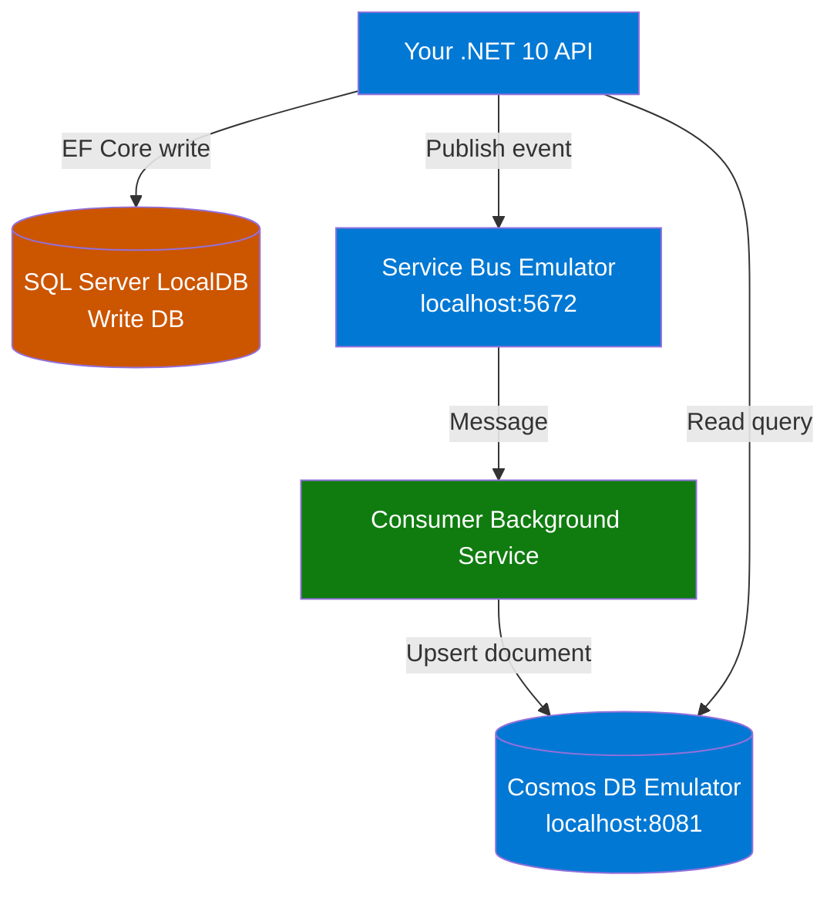

# Module 11 — Compatible Versions & Local Setup

## 1. Version Compatibility Table

All packages below are verified compatible with **.NET 10** as of April 2026.

| Package | Version | NuGet Command | Project |
|---------|---------|---------------|---------|
| `MediatR` | **13.1.0** | `dotnet add package MediatR --version 13.1.0` | `Application` |
| `MediatR.Contracts` | **2.0.1** | `dotnet add package MediatR.Contracts --version 2.0.1` | `Application` |
| `FluentValidation.AspNetCore` | **11.3.0** | `dotnet add package FluentValidation.AspNetCore` | `Application` |
| `Microsoft.Azure.Cosmos` | **3.58.0** | `dotnet add package Microsoft.Azure.Cosmos --version 3.58.0` | `Infrastructure` |
| `Azure.Messaging.ServiceBus` | **7.20.1** | `dotnet add package Azure.Messaging.ServiceBus --version 7.20.1` | `Infrastructure` |
| `Microsoft.EntityFrameworkCore.SqlServer` | **10.0.x** | `dotnet add package Microsoft.EntityFrameworkCore.SqlServer` | `Infrastructure` |
| `Microsoft.EntityFrameworkCore.Tools` | **10.0.x** | `dotnet add package Microsoft.EntityFrameworkCore.Tools` | `Infrastructure` |

> **MediatR note:** Version 13.x is the latest stable release for .NET 10. The `AddMediatR()` API is unchanged from 12.x — no migration needed if you are coming from 12.5.0.

---

## 2. Local Emulators (Zero Cost Setup)

### 2a. Cosmos DB Emulator

Two options — pick one.

**Option A: Windows Installer (recommended for Windows dev)**

```bash
# Download from Microsoft
https://aka.ms/cosmosdb-emulator
```

After install, start it from the Start menu or:
```bash
"C:\Program Files\Azure Cosmos DB Emulator\CosmosDB.Emulator.exe" /NoExplorer
```

The emulator runs at:
- **Endpoint:** `https://localhost:8081`
- **Key (fixed):** `C2y6yDjf5/R+ob0N8A7Cgv30VRDJIWEHLM+4QDU5DE2nQ9nDuVTqobD4b8mGGyPMbIZnqyMsEcaGQy67XIw/Jw==`

**Option B: Docker**

```bash
docker pull mcr.microsoft.com/cosmosdb/linux/azure-cosmos-emulator:latest

docker run \
  --publish 8081:8081 \
  --publish 10250-10255:10250-10255 \
  --name cosmosdb-emulator \
  --detach \
  mcr.microsoft.com/cosmosdb/linux/azure-cosmos-emulator:latest
```

Verify it is running: open `https://localhost:8081/_explorer/index.html` in your browser.

---

### 2b. Azure Service Bus Emulator

Requires Docker Desktop. Uses an official Microsoft image released in November 2024.

**Step 1 — Create `docker-compose.yml`** in your project root:

```yaml
version: '3.8'

services:
  servicebus-emulator:
    image: mcr.microsoft.com/azure-messaging/servicebus-emulator:latest
    ports:
      - "5672:5672"
      - "5300:5300"
    environment:
      ACCEPT_EULA: "Y"
    depends_on:
      - sqledge

  sqledge:
    image: mcr.microsoft.com/azure-sql-edge:latest
    environment:
      ACCEPT_EULA: "Y"
      SA_PASSWORD: "YourStrong@Password1"
    ports:
      - "1433:1433"
```

**Step 2 — Start the emulator:**

```bash
docker compose up -d
```

The Service Bus emulator listens on:
- **AMQP:** `localhost:5672`
- **Connection string:** `Endpoint=sb://localhost;SharedAccessKeyName=RootManageSharedAccessKey;SharedAccessKey=SAS_KEY_VALUE;UseDevelopmentEmulator=true;`

---

## 3. appsettings.Development.json

Add these connection strings so the emulator is used during local development.

```json
{
  "ConnectionStrings": {
    "WriteDb": "Server=(localdb)\\MSSQLLocalDB;Database=OrdersWriteDb;Trusted_Connection=True;"
  },
  "CosmosDb": {
    "Endpoint": "https://localhost:8081",
    "Key": "C2y6yDjf5/R+ob0N8A7Cgv30VRDJIWEHLM+4QDU5DE2nQ9nDuVTqobD4b8mGGyPMbIZnqyMsEcaGQy67XIw/Jw==",
    "DatabaseName": "OrdersReadDb",
    "ContainerName": "Orders"
  },
  "ServiceBus": {
    "ConnectionString": "Endpoint=sb://localhost;SharedAccessKeyName=RootManageSharedAccessKey;SharedAccessKey=SAS_KEY_VALUE;UseDevelopmentEmulator=true;",
    "TopicName": "order-events",
    "SubscriptionName": "order-read-projection"
  }
}
```

> In production, replace these with Azure Key Vault references or environment variables — never commit real keys.

---

## 4. Emulator Architecture


