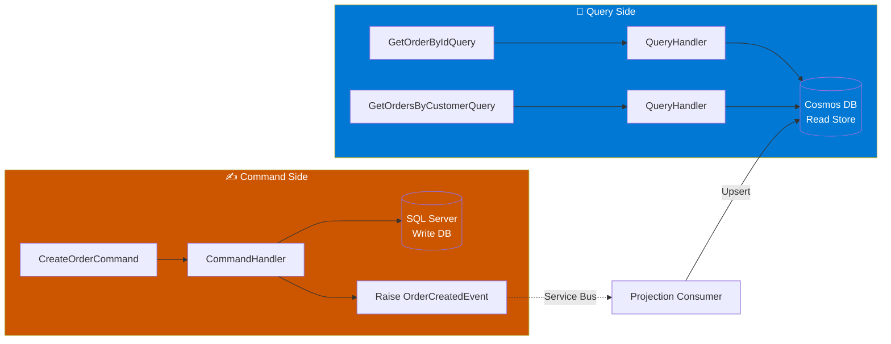

# Module 12 — Cosmos DB as the CQRS Read Store

## Why a Separate Read Store?

In CQRS, the **write model** is normalised and consistent (SQL Server via EF Core). The **read model** is denormalised and optimised purely for fast queries. Cosmos DB is ideal for the read side because:

- Schema-free documents — no JOINs, no EF overhead
- Single-document reads by partition key are extremely fast
- Scales horizontally without effort
- Native JSON — maps directly to your API response DTOs

---

## 1. Read Model Document Design

Create a flat document that contains everything a UI needs — no joins at query time.

```csharp
// Application/ReadModels/OrderReadModel.cs
public sealed class OrderReadModel
{
    public string Id { get; set; } = string.Empty;          // Cosmos document id
    public string CustomerId { get; set; } = string.Empty;  // Partition key
    public string CustomerName { get; set; } = string.Empty;
    public string Status { get; set; } = string.Empty;
    public decimal TotalAmount { get; set; }
    public List<OrderItemReadModel> Items { get; set; } = [];
    public DateTime CreatedAt { get; set; }
    public DateTime UpdatedAt { get; set; }
}

public sealed class OrderItemReadModel
{
    public string ProductName { get; set; } = string.Empty;
    public int Quantity { get; set; }
    public decimal UnitPrice { get; set; }
}
```

---

## 2. Repository Interface (Application Layer)

The Application layer defines the contract — it never references Cosmos SDK directly.

```csharp
// Application/Interfaces/IOrderReadRepository.cs
public interface IOrderReadRepository
{
    Task<OrderReadModel?> GetByIdAsync(string orderId, string customerId, CancellationToken ct = default);
    Task<IReadOnlyList<OrderReadModel>> GetByCustomerAsync(string customerId, CancellationToken ct = default);
    Task UpsertAsync(OrderReadModel model, CancellationToken ct = default);
}
```

---

## 3. Cosmos DB Repository (Infrastructure Layer)

```csharp
// Infrastructure/Persistence/CosmosOrderReadRepository.cs
public sealed class CosmosOrderReadRepository : IOrderReadRepository
{
    private readonly Container _container;

    public CosmosOrderReadRepository(CosmosClient client, IOptions<CosmosDbOptions> options)
    {
        var db = client.GetDatabase(options.Value.DatabaseName);
        _container = db.GetContainer(options.Value.ContainerName);
    }

    public async Task<OrderReadModel?> GetByIdAsync(string orderId, string customerId, CancellationToken ct = default)
    {
        try
        {
            var response = await _container.ReadItemAsync<OrderReadModel>(
                orderId,
                new PartitionKey(customerId),
                cancellationToken: ct);
            return response.Resource;
        }
        catch (CosmosException ex) when (ex.StatusCode == System.Net.HttpStatusCode.NotFound)
        {
            return null;
        }
    }

    public async Task<IReadOnlyList<OrderReadModel>> GetByCustomerAsync(string customerId, CancellationToken ct = default)
    {
        var query = new QueryDefinition("SELECT * FROM c WHERE c.customerId = @id")
            .WithParameter("@id", customerId);

        var results = new List<OrderReadModel>();
        using var iterator = _container.GetItemQueryIterator<OrderReadModel>(query,
            requestOptions: new QueryRequestOptions { PartitionKey = new PartitionKey(customerId) });

        while (iterator.HasMoreResults)
        {
            var page = await iterator.ReadNextAsync(ct);
            results.AddRange(page);
        }
        return results.AsReadOnly();
    }

    public async Task UpsertAsync(OrderReadModel model, CancellationToken ct = default)
    {
        await _container.UpsertItemAsync(
            model,
            new PartitionKey(model.CustomerId),
            cancellationToken: ct);
    }
}
```

---

## 4. MediatR Query Handlers

```csharp
// Application/Features/Orders/Queries/GetOrderByIdQuery.cs
public sealed record GetOrderByIdQuery(string OrderId, string CustomerId) : IRequest<OrderReadModel?>;

public sealed class GetOrderByIdHandler : IRequestHandler<GetOrderByIdQuery, OrderReadModel?>
{
    private readonly IOrderReadRepository _repo;
    public GetOrderByIdHandler(IOrderReadRepository repo) => _repo = repo;

    public Task<OrderReadModel?> Handle(GetOrderByIdQuery request, CancellationToken ct)
        => _repo.GetByIdAsync(request.OrderId, request.CustomerId, ct);
}
```

```csharp
// Application/Features/Orders/Queries/GetOrdersByCustomerQuery.cs
public sealed record GetOrdersByCustomerQuery(string CustomerId) : IRequest<IReadOnlyList<OrderReadModel>>;

public sealed class GetOrdersByCustomerHandler : IRequestHandler<GetOrdersByCustomerQuery, IReadOnlyList<OrderReadModel>>
{
    private readonly IOrderReadRepository _repo;
    public GetOrdersByCustomerHandler(IOrderReadRepository repo) => _repo = repo;

    public Task<IReadOnlyList<OrderReadModel>> Handle(GetOrdersByCustomerQuery request, CancellationToken ct)
        => _repo.GetByCustomerAsync(request.CustomerId, ct);
}
```

---

## 5. DI Registration (Infrastructure/DependencyInjection.cs)

```csharp
public static IServiceCollection AddCosmosDb(this IServiceCollection services, IConfiguration config)
{
    services.Configure<CosmosDbOptions>(config.GetSection("CosmosDb"));

    services.AddSingleton(sp =>
    {
        var opts = sp.GetRequiredService<IOptions<CosmosDbOptions>>().Value;
        return new CosmosClient(opts.Endpoint, opts.Key, new CosmosClientOptions
        {
            SerializerOptions = new CosmosSerializationOptions
            {
                PropertyNamingPolicy = CosmosPropertyNamingPolicy.CamelCase
            }
        });
    });

    services.AddScoped<IOrderReadRepository, CosmosOrderReadRepository>();
    return services;
}

// Options class
public sealed class CosmosDbOptions
{
    public string Endpoint { get; set; } = string.Empty;
    public string Key { get; set; } = string.Empty;
    public string DatabaseName { get; set; } = string.Empty;
    public string ContainerName { get; set; } = string.Empty;
}
```

---

## 6. CQRS Data Flow Diagram


