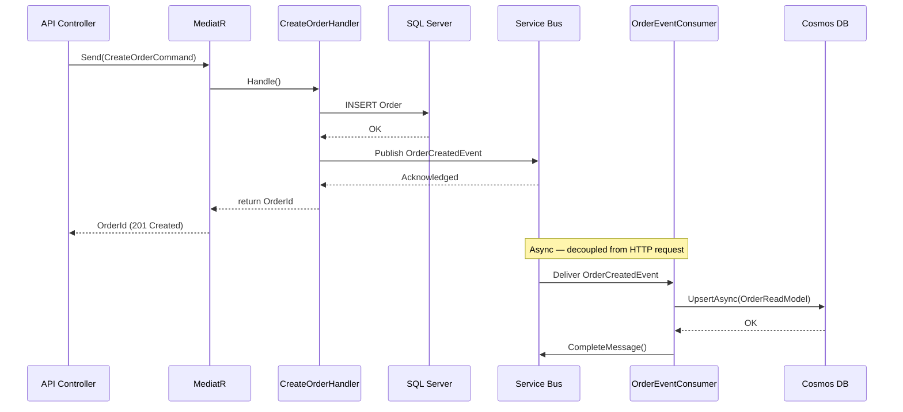

# Module 13 — Publishing & Consuming Domain Events via Azure Service Bus

## The Pattern

After a **Command** successfully modifies the write database, the handler publishes a **domain event** to Azure Service Bus. A separate **background consumer** picks up the message and projects it into Cosmos DB. This decouples the write side from the read side completely.

---

## 1. Domain Event Contract (Application Layer)

Define events in the Application layer so they are independent of any infrastructure.

```csharp
// Application/Events/OrderCreatedEvent.cs
public sealed record OrderCreatedEvent
{
    public string EventType => nameof(OrderCreatedEvent);
    public string OrderId { get; init; } = string.Empty;
    public string CustomerId { get; init; } = string.Empty;
    public string CustomerName { get; init; } = string.Empty;
    public decimal TotalAmount { get; init; }
    public List<OrderItemDto> Items { get; init; } = [];
    public DateTime OccurredAt { get; init; } = DateTime.UtcNow;
}

public sealed record OrderItemDto(string ProductName, int Quantity, decimal UnitPrice);
```

---

## 2. Service Bus Publisher Interface

```csharp
// Application/Interfaces/IEventPublisher.cs
public interface IEventPublisher
{
    Task PublishAsync<T>(T @event, CancellationToken ct = default) where T : class;
}
```

---

## 3. Service Bus Publisher Implementation (Infrastructure)

```csharp
// Infrastructure/Messaging/ServiceBusEventPublisher.cs
public sealed class ServiceBusEventPublisher : IEventPublisher, IAsyncDisposable
{
    private readonly ServiceBusSender _sender;
    private readonly ServiceBusClient _client;

    public ServiceBusEventPublisher(IOptions<ServiceBusOptions> options)
    {
        _client = new ServiceBusClient(options.Value.ConnectionString);
        _sender = _client.CreateSender(options.Value.TopicName);
    }

    public async Task PublishAsync<T>(T @event, CancellationToken ct = default) where T : class
    {
        var body = JsonSerializer.Serialize(@event);
        var message = new ServiceBusMessage(body)
        {
            ContentType = "application/json",
            Subject = typeof(T).Name,                        // acts as event type discriminator
            MessageId = Guid.NewGuid().ToString()
        };
        await _sender.SendMessageAsync(message, ct);
    }

    public async ValueTask DisposeAsync()
    {
        await _sender.DisposeAsync();
        await _client.DisposeAsync();
    }
}

public sealed class ServiceBusOptions
{
    public string ConnectionString { get; set; } = string.Empty;
    public string TopicName { get; set; } = string.Empty;
    public string SubscriptionName { get; set; } = string.Empty;
}
```

---

## 4. Updated Command Handler — Publish After Write

```csharp
// Application/Features/Orders/Commands/CreateOrderCommandHandler.cs
public sealed class CreateOrderCommandHandler : IRequestHandler<CreateOrderCommand, Guid>
{
    private readonly IOrderWriteRepository _writeRepo;
    private readonly IEventPublisher _publisher;
    private readonly IUnitOfWork _unitOfWork;

    public CreateOrderCommandHandler(
        IOrderWriteRepository writeRepo,
        IEventPublisher publisher,
        IUnitOfWork unitOfWork)
    {
        _writeRepo = writeRepo;
        _publisher = publisher;
        _unitOfWork = unitOfWork;
    }

    public async Task<Guid> Handle(CreateOrderCommand request, CancellationToken ct)
    {
        // 1. Create aggregate
        var order = Order.Create(request.CustomerId, request.CustomerName, request.Items);

        // 2. Persist to SQL Server
        await _writeRepo.AddAsync(order, ct);
        await _unitOfWork.SaveChangesAsync(ct);

        // 3. Publish domain event to Service Bus
        var @event = new OrderCreatedEvent
        {
            OrderId = order.Id.ToString(),
            CustomerId = order.CustomerId.ToString(),
            CustomerName = order.CustomerName,
            TotalAmount = order.TotalAmount,
            Items = order.Items.Select(i => new OrderItemDto(i.ProductName, i.Quantity, i.UnitPrice)).ToList()
        };

        await _publisher.PublishAsync(@event, ct);

        return order.Id;
    }
}
```

> **Tip:** If you need guaranteed delivery (no message lost if Service Bus is down), look into the **Outbox Pattern** — persist the event to the database in the same transaction, then a background job publishes it. This is an advanced follow-up topic.

---

## 5. Background Consumer — Project into Cosmos DB

```csharp
// Infrastructure/Messaging/OrderEventConsumer.cs
public sealed class OrderEventConsumer : BackgroundService
{
    private readonly ServiceBusProcessor _processor;
    private readonly IServiceScopeFactory _scopeFactory;
    private readonly ILogger<OrderEventConsumer> _logger;

    public OrderEventConsumer(
        IOptions<ServiceBusOptions> options,
        IServiceScopeFactory scopeFactory,
        ILogger<OrderEventConsumer> logger)
    {
        _scopeFactory = scopeFactory;
        _logger = logger;

        var client = new ServiceBusClient(options.Value.ConnectionString);
        _processor = client.CreateProcessor(
            options.Value.TopicName,
            options.Value.SubscriptionName,
            new ServiceBusProcessorOptions { MaxConcurrentCalls = 1 });

        _processor.ProcessMessageAsync += OnMessageAsync;
        _processor.ProcessErrorAsync += OnErrorAsync;
    }

    protected override async Task ExecuteAsync(CancellationToken stoppingToken)
    {
        await _processor.StartProcessingAsync(stoppingToken);
        await Task.Delay(Timeout.Infinite, stoppingToken).ConfigureAwait(ConfigureAwaitOptions.SuppressThrowing);
        await _processor.StopProcessingAsync();
    }

    private async Task OnMessageAsync(ProcessMessageEventArgs args)
    {
        var eventType = args.Message.Subject;

        if (eventType == nameof(OrderCreatedEvent))
        {
            var @event = JsonSerializer.Deserialize<OrderCreatedEvent>(args.Message.Body)!;

            using var scope = _scopeFactory.CreateScope();
            var repo = scope.ServiceProvider.GetRequiredService<IOrderReadRepository>();

            var readModel = new OrderReadModel
            {
                Id = @event.OrderId,
                CustomerId = @event.CustomerId,
                CustomerName = @event.CustomerName,
                TotalAmount = @event.TotalAmount,
                Status = "Pending",
                Items = @event.Items.Select(i => new OrderItemReadModel
                {
                    ProductName = i.ProductName,
                    Quantity = i.Quantity,
                    UnitPrice = i.UnitPrice
                }).ToList(),
                CreatedAt = @event.OccurredAt,
                UpdatedAt = @event.OccurredAt
            };

            await repo.UpsertAsync(readModel, args.CancellationToken);
        }

        await args.CompleteMessageAsync(args.Message);
        _logger.LogInformation("Processed {EventType} for Order {OrderId}", eventType,
            args.Message.MessageId);
    }

    private Task OnErrorAsync(ProcessErrorEventArgs args)
    {
        _logger.LogError(args.Exception, "Service Bus error on {EntityPath}", args.EntityPath);
        return Task.CompletedTask;
    }
}
```

---

## 6. DI Registration for Messaging

```csharp
// Infrastructure/DependencyInjection.cs — add to existing method
public static IServiceCollection AddMessaging(this IServiceCollection services, IConfiguration config)
{
    services.Configure<ServiceBusOptions>(config.GetSection("ServiceBus"));
    services.AddSingleton<IEventPublisher, ServiceBusEventPublisher>();
    services.AddHostedService<OrderEventConsumer>();
    return services;
}
```

---

## 7. Message Flow Diagram


