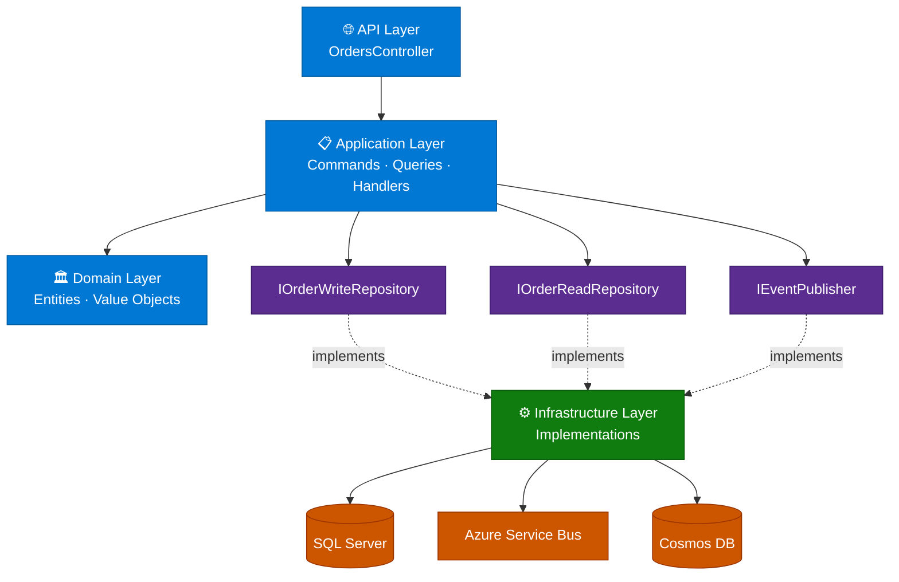
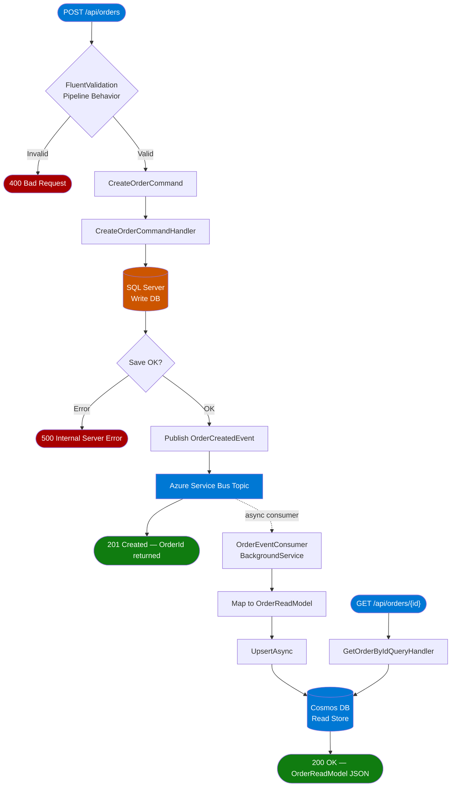

# Module 14 — End-to-End Request Flow

This module brings everything together and shows the complete picture from an HTTP request hitting your API to the read model being available in Cosmos DB.

---

## 1. Complete Solution Structure

After adding the CQRS + Cosmos DB + Service Bus pieces, your solution looks like this:

```
OrderManagement.sln
├── src/
│   ├── OrderManagement.Domain/
│   │   ├── Entities/Order.cs
│   │   ├── Entities/OrderItem.cs
│   │   └── Enums/OrderStatus.cs
│   │
│   ├── OrderManagement.Application/
│   │   ├── Features/
│   │   │   └── Orders/
│   │   │       ├── Commands/CreateOrderCommand.cs
│   │   │       ├── Commands/CreateOrderCommandHandler.cs
│   │   │       ├── Commands/CreateOrderValidator.cs
│   │   │       ├── Queries/GetOrderByIdQuery.cs
│   │   │       └── Queries/GetOrdersByCustomerQuery.cs
│   │   ├── Events/OrderCreatedEvent.cs
│   │   ├── Interfaces/
│   │   │   ├── IOrderWriteRepository.cs
│   │   │   ├── IOrderReadRepository.cs
│   │   │   ├── IEventPublisher.cs
│   │   │   └── IUnitOfWork.cs
│   │   └── ReadModels/OrderReadModel.cs
│   │
│   ├── OrderManagement.Infrastructure/
│   │   ├── Persistence/
│   │   │   ├── AppDbContext.cs                  ← EF Core (write DB)
│   │   │   ├── OrderWriteRepository.cs
│   │   │   └── CosmosOrderReadRepository.cs     ← Cosmos DB (read DB)
│   │   ├── Messaging/
│   │   │   ├── ServiceBusEventPublisher.cs
│   │   │   └── OrderEventConsumer.cs
│   │   └── DependencyInjection.cs
│   │
│   └── OrderManagement.API/
│       ├── Controllers/OrdersController.cs
│       └── Program.cs
│
└── tests/
    ├── OrderManagement.Domain.Tests/
    ├── OrderManagement.Application.Tests/
    └── OrderManagement.Infrastructure.Tests/
```

---

## 2. Complete Dependency Flow



---

## 3. Full HTTP Request Lifecycle



---

## 4. API Controller (Complete)

```csharp
// API/Controllers/OrdersController.cs
[ApiController]
[Route("api/[controller]")]
public sealed class OrdersController : ControllerBase
{
    private readonly ISender _sender;
    public OrdersController(ISender sender) => _sender = sender;

    [HttpPost]
    [ProducesResponseType(typeof(Guid), StatusCodes.Status201Created)]
    [ProducesResponseType(StatusCodes.Status400BadRequest)]
    public async Task<IActionResult> CreateOrder(
        [FromBody] CreateOrderRequest request,
        CancellationToken ct)
    {
        var command = new CreateOrderCommand(
            request.CustomerId,
            request.CustomerName,
            request.Items.Select(i => new OrderItemInput(i.ProductName, i.Quantity, i.UnitPrice)).ToList());

        var orderId = await _sender.Send(command, ct);
        return CreatedAtAction(nameof(GetById), new { id = orderId, customerId = request.CustomerId }, orderId);
    }

    [HttpGet("{id}")]
    [ProducesResponseType(typeof(OrderReadModel), StatusCodes.Status200OK)]
    [ProducesResponseType(StatusCodes.Status404NotFound)]
    public async Task<IActionResult> GetById(
        [FromRoute] string id,
        [FromQuery] string customerId,
        CancellationToken ct)
    {
        var result = await _sender.Send(new GetOrderByIdQuery(id, customerId), ct);
        return result is null ? NotFound() : Ok(result);
    }

    [HttpGet("customer/{customerId}")]
    [ProducesResponseType(typeof(IReadOnlyList<OrderReadModel>), StatusCodes.Status200OK)]
    public async Task<IActionResult> GetByCustomer(
        [FromRoute] string customerId,
        CancellationToken ct)
    {
        var results = await _sender.Send(new GetOrdersByCustomerQuery(customerId), ct);
        return Ok(results);
    }
}
```

---

## 5. Program.cs Wiring

```csharp
// API/Program.cs
var builder = WebApplication.CreateBuilder(args);

// Application layer
builder.Services.AddMediatR(cfg =>
    cfg.RegisterServicesFromAssemblyContaining<CreateOrderCommand>()
       .AddOpenBehavior(typeof(ValidationBehavior<,>)));

builder.Services.AddValidatorsFromAssemblyContaining<CreateOrderValidator>();

// Infrastructure layer
builder.Services
    .AddDbContext<AppDbContext>(opt =>
        opt.UseSqlServer(builder.Configuration.GetConnectionString("WriteDb")))
    .AddCosmosDb(builder.Configuration)
    .AddMessaging(builder.Configuration);

builder.Services.AddControllers();
builder.Services.AddEndpointsApiExplorer();
builder.Services.AddSwaggerGen();

var app = builder.Build();

if (app.Environment.IsDevelopment())
{
    app.UseSwagger();
    app.UseSwaggerUI();
}

app.UseHttpsRedirection();
app.MapControllers();
app.Run();
```

---

## 6. Quick-Start Checklist

- [ ] Docker Desktop running
- [ ] `docker compose up -d` started (Service Bus emulator)
- [ ] Cosmos DB Emulator running (Windows installer or Docker)
- [ ] `dotnet ef migrations add InitialCreate --project Infrastructure --startup-project API`
- [ ] `dotnet ef database update --project Infrastructure --startup-project API`
- [ ] `dotnet run --project API`
- [ ] Open Swagger at `https://localhost:{port}/swagger`
- [ ] POST to `/api/orders` — verify 201 response
- [ ] Wait ~1 second, then GET `/api/orders/{id}?customerId={id}` — verify Cosmos read works
- [ ] Check Cosmos emulator Data Explorer at `https://localhost:8081/_explorer/index.html` to see your document

---

## 7. Further Learning Path

| Topic | Why It Matters |
|-------|---------------|
| **Outbox Pattern** | Guarantees no message is lost if Service Bus is temporarily unavailable |
| **Event Sourcing** | Store all state changes as events — Cosmos DB is a natural fit |
| **Saga / Process Manager** | Coordinate multi-step workflows across services |
| **Azure Cosmos DB Change Feed** | Alternative to Service Bus for projections — Cosmos pushes changes to consumers |
| **Azure AD B2C + JWT** | Secure the API — directly relevant to your existing experience |
| **Azure DevOps CI/CD** | Deploy the API to Azure App Service with pipeline |
